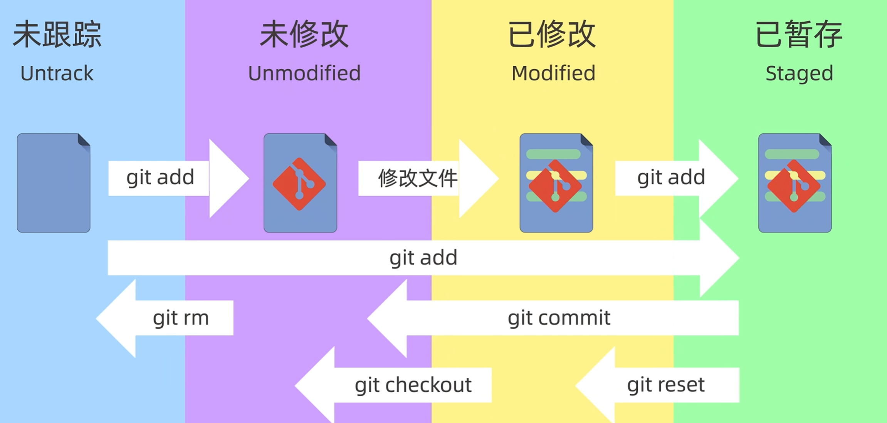

# GitNote

## 1. 创建仓库


#### git init


#### git clone

从github上克隆一个已有仓库到本地计算机

基本语法

```cpp
git clone <远程仓库地址> [本地目录名]
```

示例

```cpp
git clone git@github.com:gls1018/CPPNote.git
```


## 2. 工作区域和文件状态

git有三个区域， 工作区，暂存区, 本地仓库

本地仓库: git init初始化或者git clone 的那个文件夹就是本地仓库，包含所有数据

暂存区: 一个临时区域，用于临时存放即将提交的修改

工作区: .git所在的目录。


文件有四个状态:

Untrack: 在工作区中新添加一个文件，但却没有使用`git add`命令, 该文件就处于Untrack状态

UnModified:

Modified: 

Staged:





#### git status


#### git ls-files

`git ls-files` 是 Git 中一个**文件列表查询命令**，它的作用是列出**暂存区中的文件**。


## 3. 添加和提交文件

#### git add

将状态为`Untrack`和`Modified`的文件添加到`暂存区`。

基本语法：

```bash
git add <文件名>        # 添加单个文件
git add .              # 添加所有修改的文件
git add -A             # 添加所有修改和删除的文件
git add --all          # 和 -A 等价
git add <目录名>        # 添加指定目录下的所有文件
git add "*.cpp"        # 添加指定类型文件
```


#### git commit

将暂存区 (Staging Area)中的文件修改记录提交到本地仓库 (**Repository**)，形成一个新的提交版本 (Commit)。

| 命令                     | 作用                        |
| :----------------------- | --------------------------- |
| git commit -m "说明"     | 提交代码并添加说明          |
| git commit -a -m "说明"  | 提交已修改的文件 (自动 add) |
| git commit --amend       | 修改上一次提交说明          |
| git commit -v            | 提交时显示修改的详细内容    |
| git commit --allow-empty | 提交一个空记录              |
| git commit --no-verify   | 跳过钩子验证提交            |


## 4. 撤销修改和版本回退


## 5. 查询和列出文件

#### git ls-files


## 6. 删除文件


